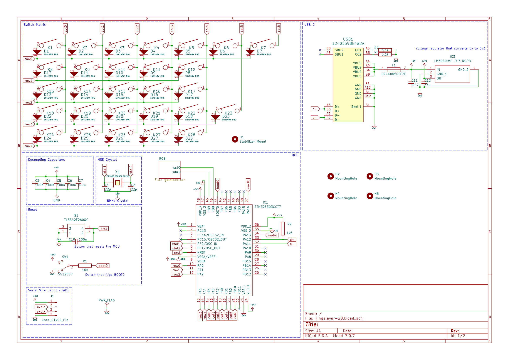
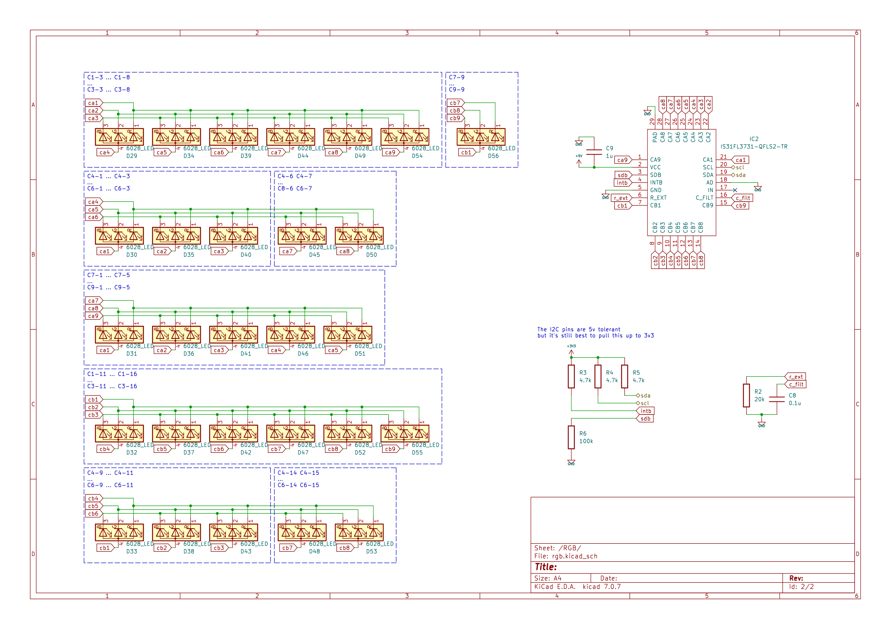

# Kingslayer 28
Fully custom 28 key gaming keypad

## Images
### Keyboard Layout

### Plate

### PCB

## Features
* Per-Key RGB
* South Facing LED
* Hot-Swap Sockets
* Custom Plate
* USB-C
* 5-pin Sockets
* Plate Mount & PCB Screw-in Stabilizer support
* Top mount design
* QMK support
* Wrist Rest with magnetic attachment mechanism
* 5 degree positive tilt

## Used
* http://www.keyboard-layout-editor.com
* http://builder.swillkb.com
* https://librecad.org
* https://www.kicad.org
